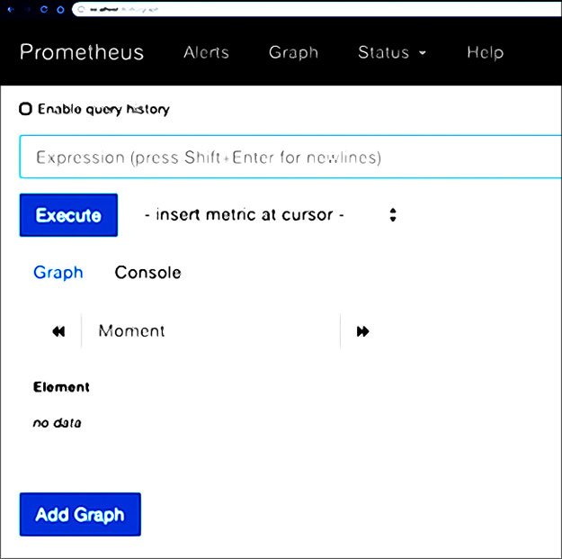
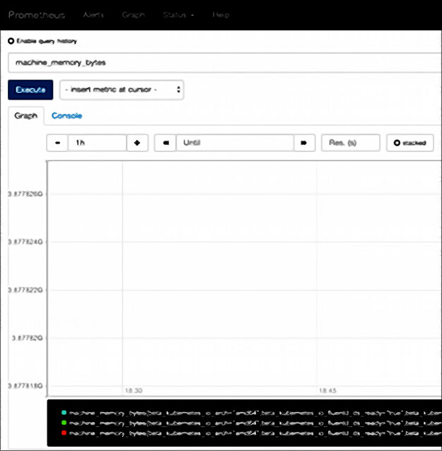

# Lab - Installer et configurer Prometheus

## Objectif

Ce lab vous permet de : 

* savoir installer prometheus sur un cluster Kubernetes
* Vérifier que Prometheus fonctionne et accéder à son interface web
* Avoir Helm installé

## Pré-requis 

* Avoir un cluster Kubernetes installer et kubectl configurer
* Vous pouvez utilisez Minikube pour cela

## Installation de Prometheus

* Commencer par récupérer le chart helm, créer un namespace et installer le helm chart
```
helm repo add prometheus-community https://prometheus-community.github.io/helm-charts
kubectl create namespace monitoring
helm install prometheus prometheus-community/kube-prometheus-stack --namespace monitoring
```
* Puis exposer le service Prometheus pour pouvoir y accéder 
```
kubectl port-forward --address 0.0.0.0 svc/prometheus-kube-prometheus-prometheus -n monitoring 9090 
```
* /!\ Laisser tourner pour accéder à Prometheus :) 

## Accéder à Prometheus

* Prometheus fournit une interface web exposer par defaut sur le port 9090
* Avec minikube utiliser localhost:9090 (ou récupérer l'URL correct avec minikube service nomduservice --url )

* Vous accéder alors à une interface ressemblant à celle-ci



* Certaines métriques de bases sont déjà surveillées et accessible, entrer dans le champs de recherche le nom `machine_memory_byte`, passez en vue graphique et cliquer sur Exécuter 
* Vous obtiendrez alors



* Les conteneurs sont également déjà monitorés, par exemple utiliser l'expression `rate(container_cpu_usage_seconds_total{container_name= »prometheus »}[1m])`pour afficher le taux d'utilisation du CPU pour le conteneur Prometheus 

* -> Votre installation de Prometheus est fonctionnelle
